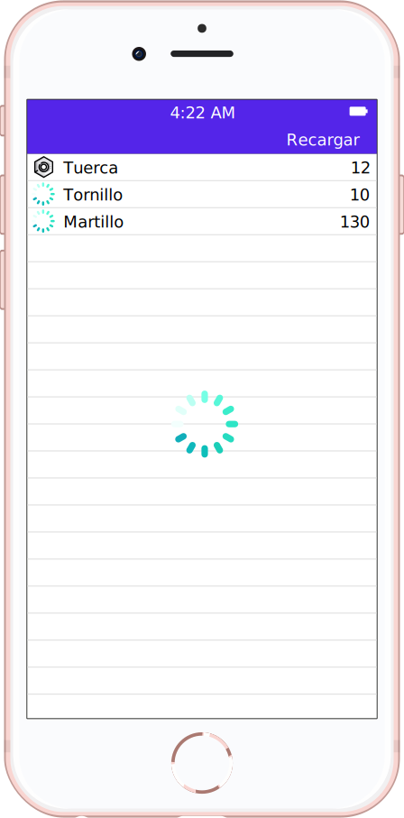
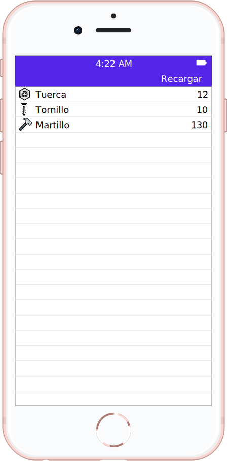

# Laboratorio 4

* Listar en una tabla los productos que vienen del servicio del ejemplo de contenido remoto.
* Mostrar un spinner mientras se espera la respuesta del servicio.
* Si se hace tap en "recargar", se limpia la tabla, y se vuelven a buscar los productos del servicio.
* Del servicio viene una url con la imagen, mostrar un spinner en la celda del producto mientras se busca la imagen.

   

